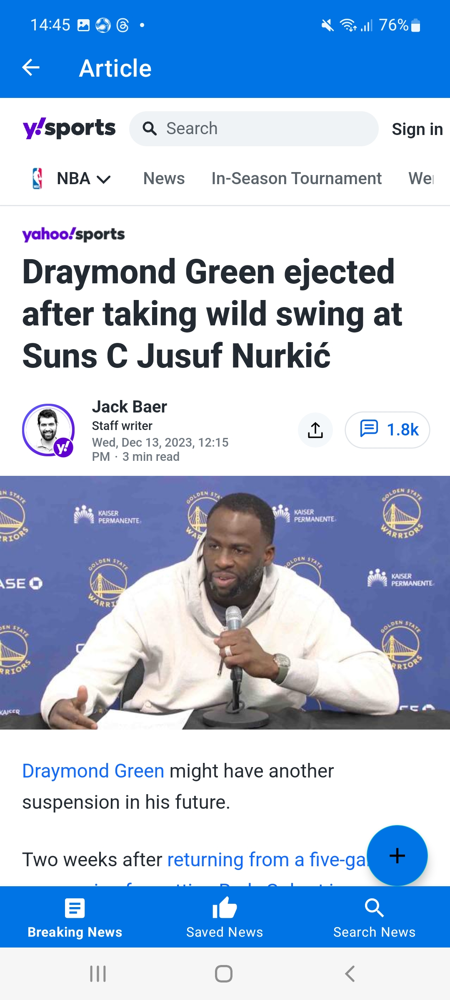

### Hi there 👋, I'm Luka Prangulashvili
#### Android Developer

I'm very motivated to become a skilled and professional Android developer. I believe I already possess some skills that make me eligible to work as an intern. However,I recognize the importance of gaining more practical, real-time experience, which will provide me with opportunities to grow and learn essential skills.

## Skills and Experience 

* 💻 Kotlin
* 📱 Android
* 👨‍💻 Firebase, Room Database, RESTful APIS
* ✅ MVVM, COROUTINES
* 🖥️ Retrofit, Gson, Json, XML, GLIDE, DEXTER

## Examples of Work

- 🌱 I’m currently learning Android Development 

    

